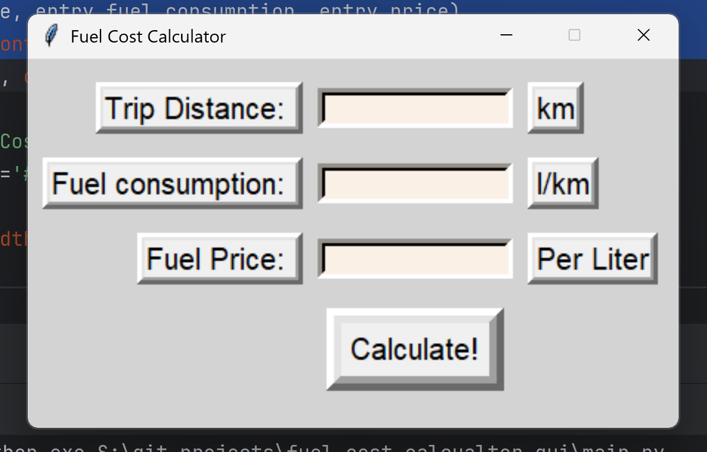

# Fuel Cost Calculator - GUI (Python)

Simple fuel cost calculator app made with Python and Python GUI library called Tkinter!

### Screenshots



> Work is still in progress!

### How to install?

1. Make sure you have python installed. You can check it by going into terminal like `python -v`
2. [Fork this repository](https://github.com/anburocky3/fuel-cost-calculator-gui-py) and run the following commands.
3. Install the dependencies using ```pip install```
4. Run the project using `python main.py`

### License: MIT

### Authors:

- Anbuselvan Rocky [https://fb.me/anburocky3](https://fb.me/anburocky3)